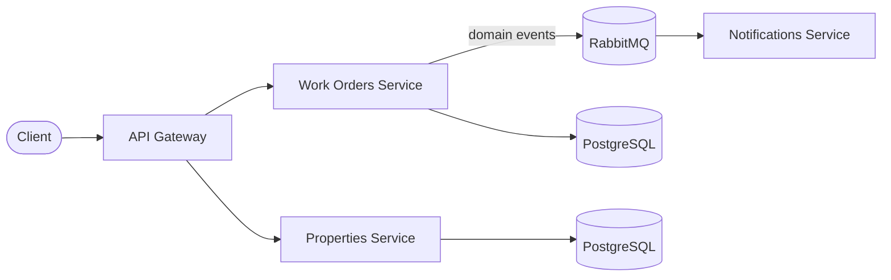

# PropFlow

A property maintenance management platform built as a **NestJS monorepo** with a **microservices, event-driven architecture** — TypeScript, PostgreSQL, RabbitMQ (Kafka planned), Docker, and full test coverage.

This repository doubles as a living study project: every architectural decision is documented as an [ADR](docs/adr) with its trade-offs, and each phase of the roadmap focuses on one production concern (messaging, observability, resilience, AI integration).

## Domain

Property managers handle a constant stream of maintenance requests: a tenant reports a leaking tap, the request must be triaged, assigned to a contractor, tracked to completion, and everyone involved must be notified along the way. PropFlow models that flow:

- **Work Orders** — the core aggregate: maintenance requests and their lifecycle (`open → assigned → in_progress → completed`).
- **Properties** — buildings and units that work orders belong to.
- **Notifications** — reacts to domain events (e.g. `work-order.created`) asynchronously.

## Architecture



Each service owns its data (database-per-service). Services communicate synchronously through the gateway for queries and asynchronously through domain events for side effects — no service calls another service's database directly.

## Tech stack

| Concern | Choice |
| --- | --- |
| Runtime / language | Node.js, TypeScript |
| Framework | NestJS (monorepo mode) |
| Database | PostgreSQL |
| Messaging | RabbitMQ (Kafka planned — see [ADR-0002](docs/adr/0002-rabbitmq-first-kafka-later.md)) |
| Testing | Jest (unit + e2e), Supertest |
| Infra | Docker Compose, GitHub Actions CI |

## Getting started

```bash
# infrastructure (PostgreSQL + RabbitMQ)
docker compose up -d

# install & run
npm install
npm run start:dev work-orders-service

# tests
npm test          # unit
npm run test:e2e  # end-to-end
```

RabbitMQ management UI: http://localhost:15672 (propflow / propflow).

## Roadmap

Each phase is a self-contained increment with tests and documentation.

- [x] **Phase 0 — Foundations**: monorepo scaffold, Docker Compose (PostgreSQL + RabbitMQ), CI, ADR structure
- [x] **Phase 1 — Work Orders service**: REST API, PostgreSQL + data modelling, validation, unit + e2e tests
- [ ] **Phase 2 — Event-driven core**: domain events over RabbitMQ, Notifications consumer, retries + dead-letter queue
- [ ] **Phase 3 — Properties service + API Gateway**: service composition, inter-service communication patterns
- [ ] **Phase 4 — Observability**: structured logging, health checks, metrics, distributed tracing
- [ ] **Phase 5 — Kafka**: event streaming for an audit/activity feed; RabbitMQ vs Kafka in practice
- [ ] **Phase 6 — AI integration**: LLM-powered triage of maintenance requests (urgency + category classification)
- [ ] **Phase 7 — Production hardening**: outbox pattern, idempotent consumers, Kubernetes manifests

## Documentation

- [Architecture Decision Records](docs/adr) — every significant decision and its trade-offs
- [Study notes](docs/notes) — deep dives on the concepts each phase exercises
