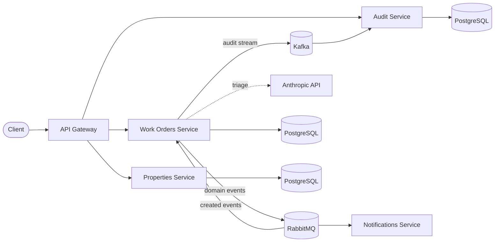

# PropFlow

A property maintenance management platform built as a **NestJS monorepo** with a **microservices, event-driven architecture** — TypeScript, PostgreSQL, RabbitMQ (Kafka planned), Docker, and full test coverage.

This repository doubles as a living study project: every architectural decision is documented as an [ADR](docs/adr) with its trade-offs, and each phase of the roadmap focuses on one production concern (messaging, observability, resilience, AI integration).

## Domain

Property managers handle a constant stream of maintenance requests: a tenant reports a leaking tap, the request must be triaged, assigned to a contractor, tracked to completion, and everyone involved must be notified along the way. PropFlow models that flow:

- **Work Orders** — the core aggregate: maintenance requests and their lifecycle (`open → assigned → in_progress → completed`), with async LLM triage (category + urgency).
- **Properties** — buildings and units that work orders belong to.
- **Notifications** — reacts to domain events (e.g. `work-order.created`) asynchronously.
- **Audit** — projects the Kafka event stream into a queryable activity feed.

## Architecture



Each service owns its data (database-per-service). Services communicate synchronously through the gateway for queries and asynchronously through domain events for side effects — no service calls another service's database directly.

## Tech stack

| Concern | Choice |
| --- | --- |
| Runtime / language | Node.js, TypeScript |
| Framework | NestJS (monorepo mode) |
| Database | PostgreSQL |
| Messaging | RabbitMQ (work distribution) + Kafka (audit stream) — see [ADR-0002](docs/adr/0002-rabbitmq-first-kafka-later.md) |
| AI | Anthropic Claude — async work-order triage, see [ADR-0006](docs/adr/0006-llm-triage.md) |
| Testing | Jest (unit + e2e), Supertest |
| Infra | Docker Compose (dev), Kubernetes ([k8s/](k8s)), GitHub Actions CI |
| Reliability | Transactional outbox + idempotent consumers — see [ADR-0007](docs/adr/0007-outbox-pattern.md) |
| Auth | JWT at the gateway, roles per route — see [ADR-0008](docs/adr/0008-authentication.md) |

## Getting started

```bash
# infrastructure (PostgreSQL + RabbitMQ + Kafka)
docker compose up -d

# install & run (one terminal per service)
npm install
npm run start:dev work-orders-service    # :3001
npm run start:dev notifications-service  # :3002
npm run start:dev properties-service     # :3003
npm run start:dev audit-service          # :3004
npm run start:dev api-gateway            # :3000 — public entry point (/api/*)

# tests
npm test          # unit
npm run test:e2e  # end-to-end
```

RabbitMQ management UI: http://localhost:15672 (propflow / propflow).

Every business route requires a JWT. Log in with a demo user (see `.env.example` to customize):

```bash
curl -s -X POST localhost:3000/api/auth/login \
  -H 'content-type: application/json' \
  -d '{"email":"manager@propflow.dev","password":"propflow"}'
# -> { "accessToken": "...", "role": "manager" }  — send as Authorization: Bearer <token>
```

## Roadmap

Each phase is a self-contained increment with tests and documentation.

- [x] **Phase 0 — Foundations**: monorepo scaffold, Docker Compose (PostgreSQL + RabbitMQ), CI, ADR structure
- [x] **Phase 1 — Work Orders service**: REST API, PostgreSQL + data modelling, validation, unit + e2e tests
- [x] **Phase 2 — Event-driven core**: domain events over RabbitMQ, Notifications consumer, retries + dead-letter queue
- [x] **Phase 3 — Properties service + API Gateway**: service composition, inter-service communication patterns
- [x] **Phase 4 — Observability**: structured logging, correlation ids, Prometheus metrics, liveness/readiness probes
- [x] **Phase 5 — Kafka**: event streaming for an audit/activity feed; RabbitMQ vs Kafka in practice
- [x] **Phase 6 — AI integration**: LLM-powered triage of maintenance requests (urgency + category classification)
- [x] **Phase 7 — Production hardening**: outbox pattern, idempotent consumers, Kubernetes manifests
- [x] **Phase 8 — Authentication & authorization**: JWT at the edge, role-based routes, identity propagated into the audit trail

## Documentation

- [Architecture Decision Records](docs/adr) — every significant decision and its trade-offs
- [Sequence flows](docs/flows.md) — how actors and services interact, flow by flow (write path, outbox relay, event fan-out, AI triage, retries/DLQ, composition, activity feed)
- [Study notes](docs/notes) — deep dives on the concepts each phase exercises
