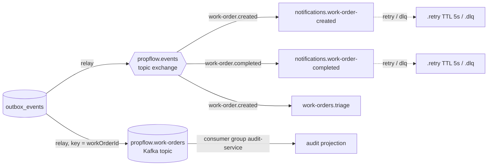

# Event catalog

The asynchronous contract of the platform — the counterpart of the [API reference](api.md) for everything that travels through brokers instead of HTTP. The typed source of truth is [`libs/contracts`](https://github.com/mhayk/propflow/tree/main/libs/contracts/src); this page is its narrative form, and the **formal spec is [AsyncAPI](https://mhayk.github.io/propflow/asyncapi/)** ([`asyncapi.yaml`](https://github.com/mhayk/propflow/blob/main/asyncapi.yaml), validated in CI) — the industry standard for event-driven APIs, rendered interactively the way OpenAPI is at `/api/docs`. How each event flows end to end: [sequence diagrams](flows.md).

## The envelope

Every event travels inside the same envelope (`EventEnvelope` in `libs/contracts`):

| Field | Type | Semantics |
| --- | --- | --- |
| `eventId` | uuid | Unique per event — **the idempotency key** every consumer dedupes on (at-least-once delivery makes duplicates routine) |
| `type` | string | The routing key (see catalog below) |
| `occurredAt` | ISO 8601 | Domain time — when the state changed, not when the message was delivered |
| `correlationId` | string \| null | The `x-request-id` of the HTTP call that caused the event; one user action is grep-able across services and the async boundary |
| `actorId` | string \| null | Who did it (JWT subject). `null` means system-initiated — e.g. the AI triage consumer — which is information, not absence |
| `data` | object | The work-order snapshot (schema below) |

## Transport topology

Events are staged in the transactional outbox ([ADR-0007](adr/0007-outbox-pattern.md)) and relayed to **both** brokers — RabbitMQ fans out transient reactions, Kafka retains the replayable history ([ADR-0002](adr/0002-rabbitmq-first-kafka-later.md)):



- **RabbitMQ**: topic exchange `propflow.events`, routing key = event type. Failed notification handlers use the TTL retry pattern — `<queue>.retry` (no consumer, 5s TTL, dead-letters back to the main queue) for up to **3 attempts**, then parked in `<queue>.dlq` on the `propflow.dlx` exchange with `x-last-error` for inspection and manual replay.
- **Kafka**: topic `propflow.work-orders`, keyed by `workOrderId` so one aggregate's events keep their order within a partition. The audit service consumes with group `audit-service`; a fresh group at offset 0 rebuilds the projection from history.

## Catalog

| Event (routing key) | Emitted when | Consumers |
| --- | --- | --- |
| `work-order.created` | A maintenance request is opened (`POST /work-orders`) | notifications (manager alert) · triage (AI classification) · audit |
| `work-order.assigned` | A manager assigns or reassigns a technician | audit |
| `work-order.started` | Status moves to `in_progress` | audit |
| `work-order.completed` | Status moves to `completed` | notifications (tenant alert) · audit |
| `work-order.cancelled` | Cancelled from any non-terminal state | audit |
| `work-order.triaged` | The AI classification is applied (async, after `created`) | audit |

Every event is also consumed by the audit projection — the Kafka side receives **all** of them regardless of RabbitMQ bindings.

## Payload (`data`)

The full work-order snapshot at the time of the event (`WorkOrderEventData`):

| Field | Type | Notes |
| --- | --- | --- |
| `workOrderId` | uuid | Aggregate id — also the Kafka partition key |
| `propertyId` | uuid | Cross-service reference (id only, never a DB foreign key) |
| `title` / `description` | string | The request as reported |
| `priority` | `low · medium · high · urgent` | Tenant-reported — a hint, not ground truth |
| `status` | `open · assigned · in_progress · completed · cancelled` | Post-transition state |
| `assigneeId` | uuid \| null | Set from `assigned` onwards |
| `triage` | object \| null | Present once classified: `{ category, urgency, reasoning }` with closed vocabularies (`plumbing · electrical · hvac · appliance · structural · pest_control · other` / `emergency · high · medium · low`) |

### Example — `work-order.triaged`

```json
{
  "eventId": "9f6f5a2e-1d0c-4b7a-9c1e-3f8a2b6d4e10",
  "type": "work-order.triaged",
  "occurredAt": "2026-07-22T14:03:07.412Z",
  "correlationId": "b3d2c1a0-…",
  "actorId": null,
  "data": {
    "workOrderId": "55555555-5555-4555-8555-555555555555",
    "propertyId": "11111111-1111-4111-8111-111111111111",
    "title": "Burst pipe in bathroom",
    "description": "Water is pouring out from under the sink",
    "priority": "high",
    "status": "open",
    "assigneeId": null,
    "triage": {
      "category": "plumbing",
      "urgency": "emergency",
      "reasoning": "Active water leak causing damage in progress."
    }
  }
}
```

`actorId` is `null` here because triage is system-initiated; the same order's `created` event carries the tenant's identity.

## Delivery guarantees

**At-least-once, end to end** — the outbox relay re-publishes on any failure, so every consumer dedupes by `eventId` with the technique that fits its storage:

| Consumer | Idempotency guard |
| --- | --- |
| Audit projection | `INSERT … ON CONFLICT (event_id) DO NOTHING` |
| AI triage | `triaged_at IS NOT NULL` natural-state check |
| Notifications | processed-events store, marked only after a successful send |

Ordering is guaranteed **per aggregate on the Kafka side** (partition key); RabbitMQ consumers do not depend on order.

## Evolution rules

- The contract is code: renaming an event or field is a compile-time refactor across every producer and consumer (`@app/contracts`).
- New payload fields are **optional** on the type so historical events (and the replayable Kafka log) remain parseable — `triage` and `actorId` were added this way.
- Enums are closed vocabularies exported from the contract; the AI's JSON schema is built from the same constants, so not even the model can invent a value.
