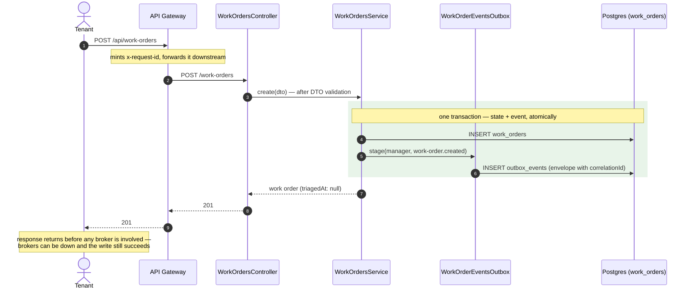
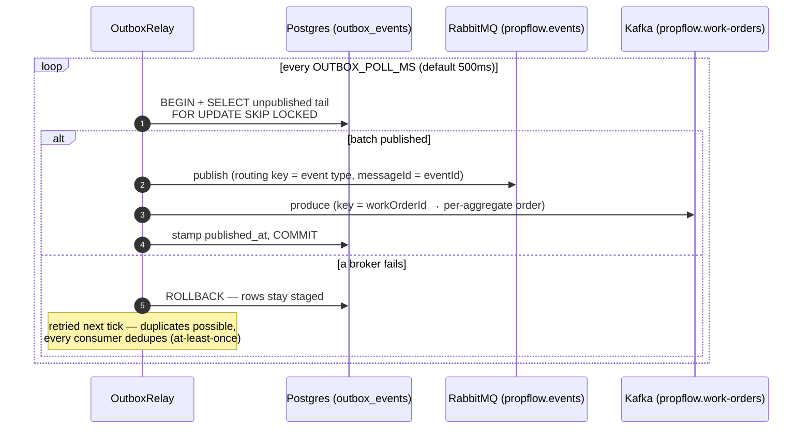
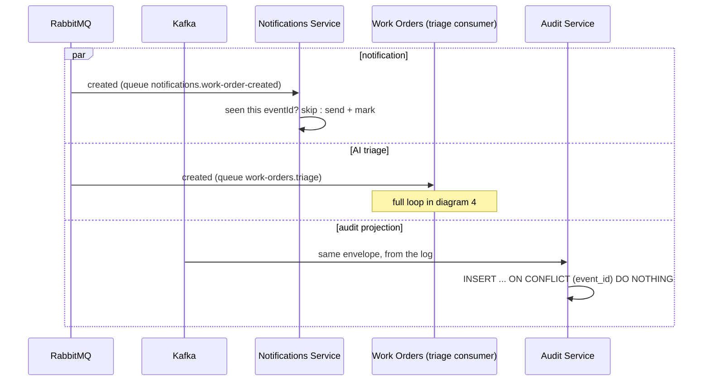
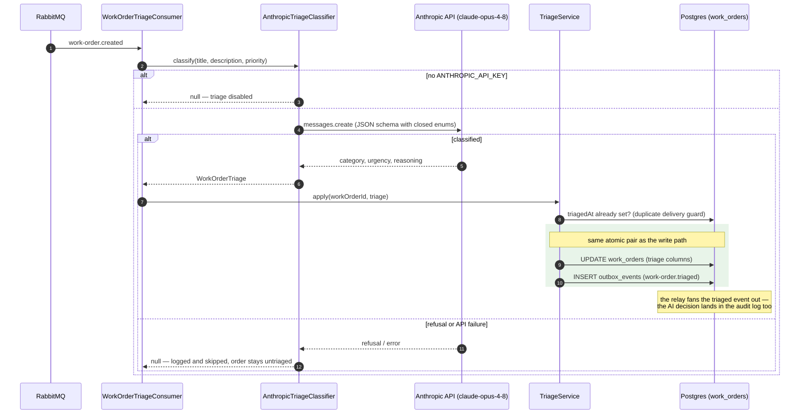
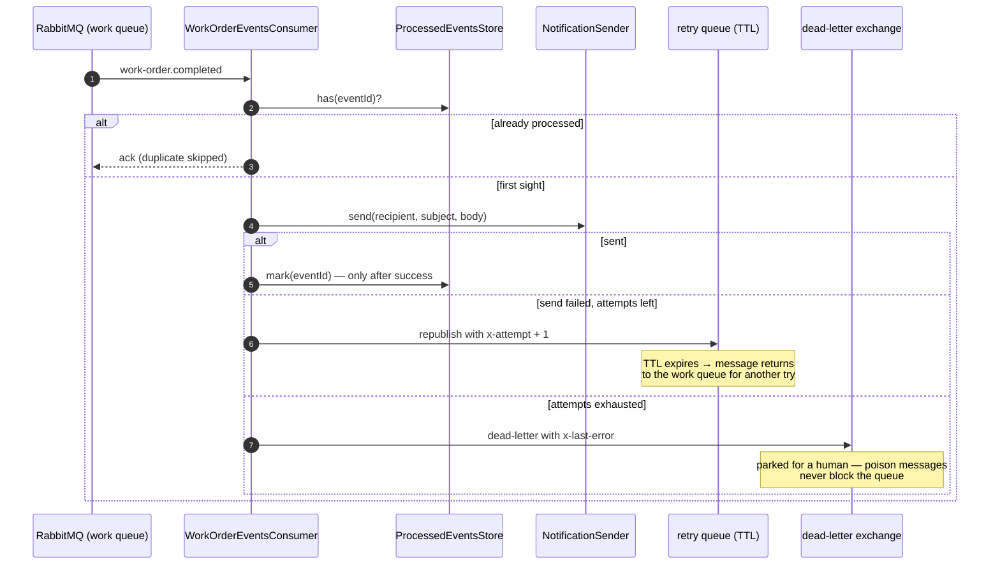
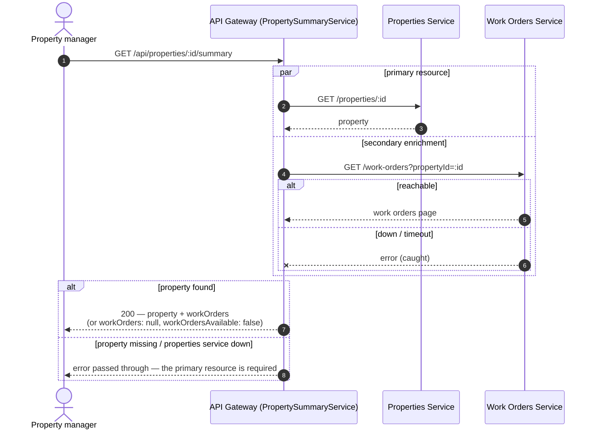
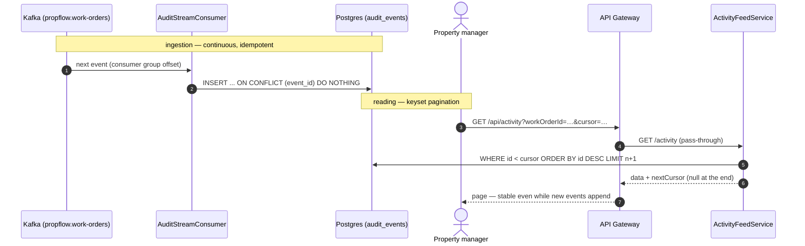
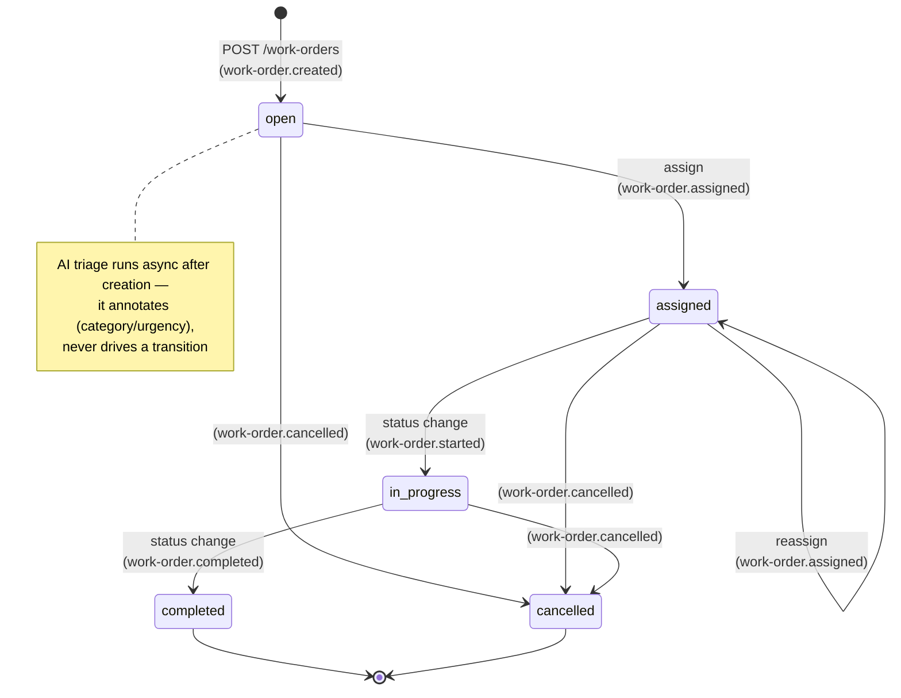

# Sequence flows

How the pieces of PropFlow interact — per flow, with the actors that trigger them and the internal components of each service. These complement the [architecture diagram](../README.md#architecture) (static structure) and the [ADRs](adr) (why it's built this way): here the question is *what happens, in what order*.

**Actors**

| Actor | Interacts via | Typical actions |
| --- | --- | --- |
| Tenant | Client app → API Gateway | opens maintenance requests |
| Property manager | Client app → API Gateway | assigns/tracks work orders, reads summaries and the activity feed |
| Technician | Client app → API Gateway | moves work orders through the lifecycle |
| Anthropic API | called by the Work Orders service | classifies requests (category + urgency) |

All HTTP enters through the gateway under the `/api` prefix; no client talks to a service directly, and no service touches another service's database.

---

## 1. Creating a work order (the write path)

The defining property of the write path after phase 7: **it never talks to a broker**. The state change and its event commit in one Postgres transaction ([ADR-0007](adr/0007-outbox-pattern.md)); everything asynchronous happens later, off the request.

Assigning (`PATCH :id/assign`) and status transitions (`PATCH :id/status`) follow the same shape: state-machine guard → transaction → outbox row (`assigned`, `started`, `completed`, `cancelled`).

## 2. The outbox relay (staged rows → brokers)

Runs inside the Work Orders service on a poll interval. `FOR UPDATE SKIP LOCKED` lets multiple replicas relay concurrently without double-publishing.

## 3. Event fan-out (who reacts to `work-order.created`)

One event, three independent consumers — none knows the others exist. RabbitMQ fans out transient reactions; Kafka retains the replayable history ([ADR-0002](adr/0002-rabbitmq-first-kafka-later.md)).

## 4. AI triage (async classification loop)

The Work Orders service reacting to *its own* event ([ADR-0006](adr/0006-llm-triage.md)) — the LLM sits behind the `TriageClassifier` seam and every failure degrades to "no classification".

## 5. Notification delivery, retries and the dead letter

What happens when the side effect fails — TTL-based retry, then dead-lettering with the error attached (phase 2 machinery).

## 6. Property summary (composition with graceful degradation)

The gateway as composer: two downstream calls in parallel, and the secondary one is allowed to fail without failing the request (phase 3).

## 7. Activity feed (audit read path — and how it fills)

Two halves that never meet synchronously: Kafka ingestion keeps the projection current; reads paginate it by keyset. Replay is the superpower — point a fresh consumer group at offset 0 and the table rebuilds.

## 8. Work order lifecycle (state machine)

Not a sequence but the state chart the transitions in diagrams 1 and 4 are guarded by (`work-order-transitions.ts`). `assigned` is only reachable through the assign endpoint — the one transition that guarantees an assignee exists — and cancellation is possible from any non-terminal state. Each transition emits the matching domain event through the outbox.

