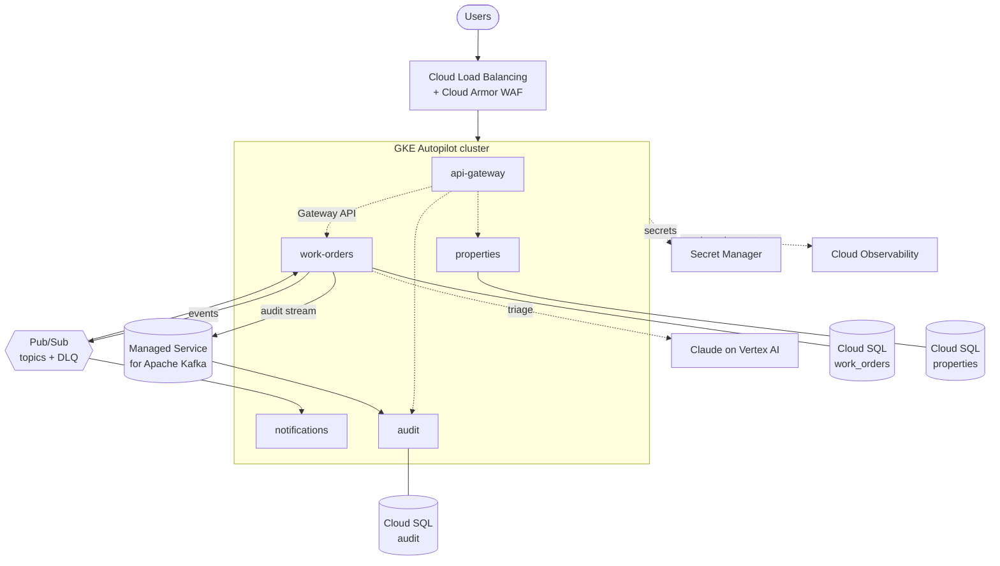

# Running on Google Cloud

A deployment study, not a decision: PropFlow is cloud-agnostic by construction, and this page shows what it would take to run it on **Google Cloud Platform**. The interesting result is how *little* changes — every managed service below plugs into a seam the architecture already has, and the application code that moves is close to zero. The rest is where the trade-offs actually live.

This is a target-mapping exercise, so it lives here rather than as an [ADR](adr/README.md) — nothing is being decided, and the [Kubernetes manifests](https://github.com/mhayk/propflow/tree/main/k8s) already in the repo are the starting point.

## The target picture



## Service mapping

| PropFlow today | On GCP | Why it fits — and the trade-off |
| --- | --- | --- |
| Kubernetes manifests | **GKE Autopilot** | The manifests, probes and NetworkPolicies already exist. Autopilot removes node management; its Dataplane V2 (Cilium) enforces the [existing NetworkPolicies](adr/0008-authentication.md) natively. Standard mode is the fallback if you need DaemonSets or specific machine types. |
| PostgreSQL (per service) | **Cloud SQL for PostgreSQL** | Database-per-service maps to one instance (or one database) per service. AlloyDB is the step up if a service outgrows Cloud SQL. `migrationsRun` on boot still works; a pre-deploy `Job` is the production-grade move. |
| RabbitMQ (work distribution) | **Pub/Sub** *or* RabbitMQ on GKE | See the deep-dive below — this is the one swap with a real semantic gap worth defending in an interview. |
| Kafka (audit stream) | **Managed Service for Apache Kafka** | GA on GCP, protocol-compatible: consumer groups, offset replay and partition-key ordering are unchanged. The audit service's "fresh group at offset 0 rebuilds the projection" property survives intact. |
| Anthropic API (triage) | **Claude on Vertex AI** | The headline: because triage sits behind the `TriageClassifier` seam ([ADR-0006](adr/0006-llm-triage.md)), this is a one-class change (below). Vertex authenticates via ADC — no API key to store. |
| Kubernetes Secrets | **Secret Manager** (+ External Secrets Operator) | `JWT_SECRET`, DB passwords, any Vertex-adjacent config. ESO syncs them into the cluster as native Secrets, so the manifests are unchanged. |
| GitHub Actions CI | **unchanged**, deploy via **Workload Identity Federation** | Keyless auth from Actions to GCP — no long-lived service-account key living in a repo secret. A maturity signal worth naming explicitly. |
| Prometheus + pino | **Managed Service for Prometheus** + **Cloud Logging** | The phase-4 JSON logs land structured with zero change; the RED metrics scrape into Managed Prometheus. The correlation id already threaded through every log is the hook for **Cloud Trace** (the OTel step ADR-0005 left open). |
| Gateway ingress | **Gateway API + Cloud Load Balancing** (+ Cloud Armor) | The gateway stays the single front door; Cloud Armor adds WAF/rate-limiting at the edge. Worth discussing: keep JWT-at-the-gateway ([ADR-0008](adr/0008-authentication.md)) or offload to **Identity-Aware Proxy** — a real architecture fork. |
| Service discovery | **unchanged** | [ADR-0009](adr/0009-service-discovery.md) already concluded "the platform is the registry." On GKE, the platform *is* GCP — CoreDNS, Services and readiness gating work identically. |

## The RabbitMQ decision (the one worth defending)

Kafka → Managed Kafka is a non-event. RabbitMQ → Pub/Sub is the swap with a genuine trade-off, and naming it precisely is the point:

- **What Pub/Sub gives you for free:** the [TTL-retry + dead-letter machinery](flows.md#5-notification-delivery-retries-and-the-dead-letter) we hand-built ([ADR-0004](adr/0004-golevelup-rabbitmq-over-nest-transport.md)) becomes *configuration* — Pub/Sub has native retry policies with exponential backoff and dead-letter topics. A chunk of `EventRetryHandler` and `messaging-resilience.ts` would simply delete.
- **What you lose:** RabbitMQ's topic-exchange routing (`work-order.*` binding keys) has no direct equivalent. Pub/Sub routes by topic; per-type fan-out becomes either one topic per event type, or one topic with subscription filters on a message attribute. Neither is wrong — but it's a routing-model change, not a lift-and-shift.
- **The honest recommendation:** for a greenfield GCP build, Pub/Sub is the idiomatic choice and the operational win is real. For *this* codebase, RabbitMQ-on-GKE is the zero-code-change path. The interview answer is "I'd move to Pub/Sub deliberately, delete the retry code, and accept re-modelling the routing — here's the diff," not "I'd lift RabbitMQ because it's less work."

## What actually changes in the code

Strikingly little — which is the architecture proving itself:

1. **Environment configuration** — DB hosts, broker endpoints, and service URLs move from the ConfigMap to Cloud SQL connection names / Pub/Sub topic ids. No code: they were always env vars ([ADR-0009](adr/0009-service-discovery.md)).
2. **One class, for Vertex triage** — the `TriageClassifier` abstraction means swapping the Anthropic client for the Vertex one is a single binding. Sketch:

    ```ts
    // AnthropicTriageClassifier, GCP variant — the seam is the whole point
    import { AnthropicVertex } from '@anthropic-ai/vertex-sdk';

    this.client = new AnthropicVertex({
      projectId: process.env.GCP_PROJECT_ID,
      region: process.env.VERTEX_REGION ?? 'us-east5',
    });
    // model id is the bare string on Vertex: 'claude-opus-4-8'
    // auth is ADC (Workload Identity) — no ANTHROPIC_API_KEY
    ```

    The `classify()` method, the JSON-schema structured output, the best-effort semantics — all unchanged. This is exactly why the seam exists.
3. **If moving to Pub/Sub** — the `@golevelup/nestjs-rabbitmq` consumers/producers swap for `@google-cloud/pubsub`, and the hand-rolled retry code deletes. This is the one non-trivial code change, and it *shrinks* the codebase.

Everything else — the state machine, the outbox relay, the audit projection, the auth guards, the whole domain — is untouched.

## Appendix: could it be Cloud Run instead of GKE?

Worth raising because it shows you know where serverless stops:

- **Fits cleanly:** api-gateway, properties — stateless request/response services scale to zero and back.
- **Needs care:** work-orders and audit run background loops (the [outbox relay](flows.md#2-the-outbox-relay-staged-rows-brokers) polling, the Kafka consumer). Cloud Run scales on request traffic, so these need `min-instances: 1` and **CPU always-allocated** — otherwise the relay stops draining between requests and the consumer misses the stream. At that point you're paying for an always-on container to get GKE semantics; GKE is the better home for them.
- **The clean split:** gateway + properties on Cloud Run, event-driven services on GKE, is a legitimate hybrid — but a single GKE cluster is simpler to reason about for a system this size.

## Honest limitations of this study

- **Not deployed** — this is a mapping, validated against GCP's service capabilities, not a running system. Terraform/Config Connector manifests would be the next artifact.
- **Cost isn't modelled** — Autopilot + three Cloud SQL instances + Managed Kafka is not the cheap end; a real proposal would right-size (shared Cloud SQL, Pub/Sub over Kafka where replay isn't needed).
- **The Pub/Sub routing re-model is sketched, not designed** — the subscription-filter vs topic-per-type choice deserves its own spike.
- **Data residency / VPC-SC, IAM least-privilege per service, and backup/DR** are all real GCP concerns this page doesn't cover — deliberately, to keep the focus on architectural portability.
