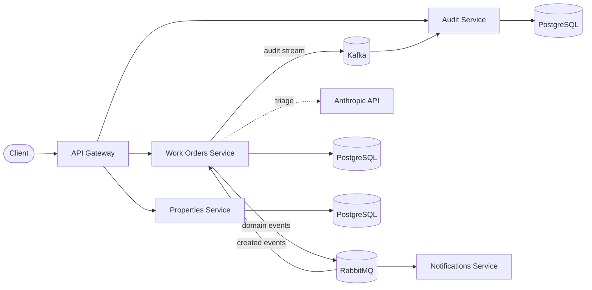

# PropFlow

A property maintenance management platform built as a **NestJS monorepo**, developed phase by phase as a deep-dive into event-driven microservice architecture — from the first REST endpoint to Kafka streaming, LLM-powered triage, the transactional outbox and JWT auth.

Source: [github.com/mhayk/propflow](https://github.com/mhayk/propflow)

## Architecture

Each service owns its data (database-per-service). Queries travel synchronously through the gateway; side effects travel asynchronously as domain events — staged in a transactional outbox, fanned out by RabbitMQ, retained forever by Kafka.

## Reading guide

- **[Services map](services.md)** — each service's mission, its world in a diagram, and its explicit non-responsibilities.
- **[Design patterns](patterns.md)** — every pattern in the codebase, where it lives, and the ones deliberately left out.
- **[Running on GCP](gcp.md)** — how the platform would map onto Google Cloud, and how little code moves.
- **[API reference](api.md)** — every endpoint with its required role; interactive OpenAPI at `/api/docs` on a running gateway.
- **[Sequence flows](flows.md)** — how actors and services interact, diagram by diagram: auth, the write path, the outbox relay, event fan-out, AI triage, retries/DLQ, composition, the activity feed, and the work-order state machine.
- **[ADRs](adr/README.md)** — every significant decision and the trade-offs behind it.
- **[Study notes](notes/README.md)** — the concepts each phase exercises, written as it was built.
