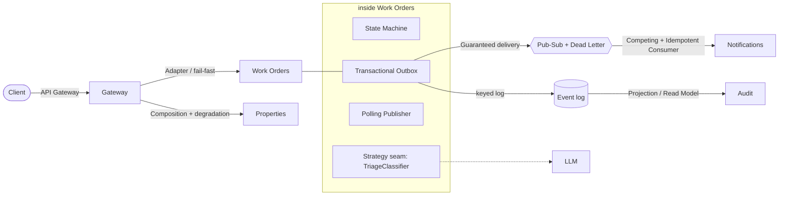

# Design patterns

A catalog of the patterns actually used in the codebase — organized *by pattern*, with where each one lives and the decision or flow that explains it. This is a different cut of the same material as the [ADRs](adr/README.md) (which are organized by *decision*) and the [services map](services.md) (organized by *boundary*): here the question is "what named technique is this, and where do I find it?".

Two rules kept this list honest: every entry points at real code, and patterns that *look* similar but aren't actually here (full Event Sourcing, Saga, Circuit Breaker) are called out in the last section rather than over-claimed — knowing when *not* to apply a pattern is the same skill as applying one.

## Patterns on the architecture

## Architectural & distributed patterns

| Pattern | What it is here | Reference |
| --- | --- | --- |
| **API Gateway** | Single public entry point; auth, routing, composition — never owns data | [services (gateway)](services.md#api-gateway-the-single-front-door-3000) |
| **Database per Service** | Each service owns its schema outright; cross-service refs are opaque ids, never FKs | [ADR-0001](adr/0001-nestjs-monorepo.md) |
| **Transactional Outbox** | Event row committed in the same transaction as the state change (`outbox_events`), closing the dual-write gap | [ADR-0007](adr/0007-outbox-pattern.md) · `messaging/work-order-events.outbox.ts` |
| **Polling Publisher** | The relay drains the unpublished tail (`FOR UPDATE SKIP LOCKED`) to both brokers | [flow 2](flows.md#2-the-outbox-relay-staged-rows-brokers) · `messaging/outbox-relay.ts` |
| **Event-Driven Architecture** | Side effects travel as domain events; producers and consumers never know each other | [flow 3](flows.md#3-event-fan-out-who-reacts-to-work-ordercreated) |
| **Projection / Read Model** | `audit_events` is a disposable materialized view over the Kafka log — rebuildable from offset 0 (a projection over an event log, *not* full event sourcing) | [flow 7](flows.md#7-activity-feed-audit-read-path-and-how-it-fills) · `audit/audit-ingest.service.ts` |
| **Publish-Subscribe** | Topic exchange fans one event out to independent consumers | [ADR-0002](adr/0002-rabbitmq-first-kafka-later.md) |
| **Competing Consumers** | RabbitMQ work queues distribute messages across consumer instances | [ADR-0004](adr/0004-golevelup-rabbitmq-over-nest-transport.md) |
| **Dead Letter Channel + Retry** | TTL retry queue (5s × 3) then a `.dlq` parked for humans, with `x-last-error` | [flow 5](flows.md#5-notification-delivery-retries-and-the-dead-letter) · `notifications/messaging-resilience.ts` |
| **Idempotent Consumer** | Every consumer dedupes by `eventId` — `ON CONFLICT`, `triaged_at`, processed-events set | [events (delivery)](events.md#delivery-guarantees) |
| **Correlation Identifier** | `x-request-id` threads through HTTP *and* the async hop (`correlationId` in the envelope) | [ADR-0005](adr/0005-observability-stack.md) · `libs/observability/src/request-context.ts` |
| **Health Check API** | Liveness (`/health`, no deps) vs readiness (`/health/ready`, checks deps) | [ADR-0005](adr/0005-observability-stack.md) |

## Application & object patterns

| Pattern | What it is here | Reference |
| --- | --- | --- |
| **Dependency Injection** | NestJS's backbone — every collaborator is injected, which is what makes the seams below testable | throughout |
| **Strategy (seam)** | An abstract class the code depends on, bound to a concrete impl: `TriageClassifier`, `NotificationSender` — swap provider = swap one binding | [ADR-0006](adr/0006-llm-triage.md) · `triage/triage-classifier.ts` |
| **Repository + Data Mapper** | TypeORM repositories over entities; data-mapper (not active-record) keeps entities persistence-agnostic | [ADR-0003](adr/0003-typeorm-over-prisma.md) |
| **State Machine** | Explicit allowed-transition table guards the work-order lifecycle | [flow 8](flows.md#8-work-order-lifecycle-state-machine) · `work-orders/work-order-transitions.ts` |
| **Chain of Responsibility** | Guard chain: `JwtAuthGuard` (authn) then `RolesGuard` (authz) — 401 before 403 | [ADR-0008](adr/0008-authentication.md) · `auth/jwt-auth.guard.ts` |
| **Decorator** | Custom route decorators `@Public()`, `@Roles()`, `@CurrentUser()` carry metadata the guards read | `auth/auth.decorators.ts` |
| **Interceptor (around-advice)** | The RED-metrics interceptor wraps every handler to time and label it | `libs/observability/src/metrics/http-metrics.interceptor.ts` |
| **Middleware** | The request-context middleware opens the ambient store before anything else runs | `libs/observability/src/request-context.middleware.ts` |
| **Ambient Context** | `AsyncLocalStorage` makes the request id and user id readable anywhere on the async path without threading params | [ADR-0005](adr/0005-observability-stack.md) · `request-context.ts` |
| **Adapter** | `DownstreamClient` wraps `fetch` with the gateway's downstream policy (timeout, 502/504 translation, header propagation) | `gateway/http/downstream.client.ts` |
| **Factory** | `buildDataSourceOptions`, `buildLoggerOptions`, `buildOpenApiDocument` — one source of truth for wiring, shared by app and tooling | `work-orders-service/src/config/typeorm.config.ts` |
| **DTO + Validation** | Request DTOs with `class-validator`; response shapes as typed contracts (also the OpenAPI schema) | [api reference](api.md) |

## Patterns deliberately NOT used (and why)

The judgment half of the catalog — each of these is a reasonable thing to reach for, and each was left out on purpose:

| Pattern | Why not | When it would return |
| --- | --- | --- |
| **Full Event Sourcing** | The audit log is a *projection*, and services persist current state normally — not every state change is reconstructed from events | If the domain needed temporal queries or per-aggregate replay as a first-class feature |
| **Saga / Process Manager** | No multi-service transaction needs orchestration + compensation here; each event's effect is local and idempotent | A cross-service workflow with rollback (e.g. reserve → charge → dispatch) |
| **Circuit Breaker** | The gateway fails fast per request (3s timeout) but never opens a circuit — accepted, and documented | A persistently slow/failing downstream under real load |
| **CQRS (separate write model)** | Reads and writes share the same model per service; the audit projection is the only read-optimized view, and it's fed by events | Read and write loads that need independently-scaled models |
| **Service Registry (Consul/Eureka)** | The orchestrator is the registry — DNS + readiness gating | Instances outside a single cluster, or registry-driven routing | 
| **Backends for Frontends** | One gateway serves all clients; there's no per-frontend backend | Divergent client needs (mobile vs web) worth separate composition layers |

References for the "not used" reasoning: service discovery in [ADR-0009](adr/0009-service-discovery.md), the circuit-breaker gap in the [phase-3 notes](notes/phase-3-gateway-composition.md), and event-sourcing scope in [ADR-0002](adr/0002-rabbitmq-first-kafka-later.md).
