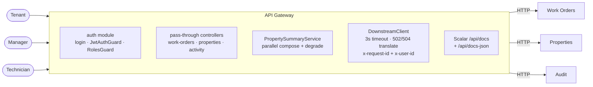
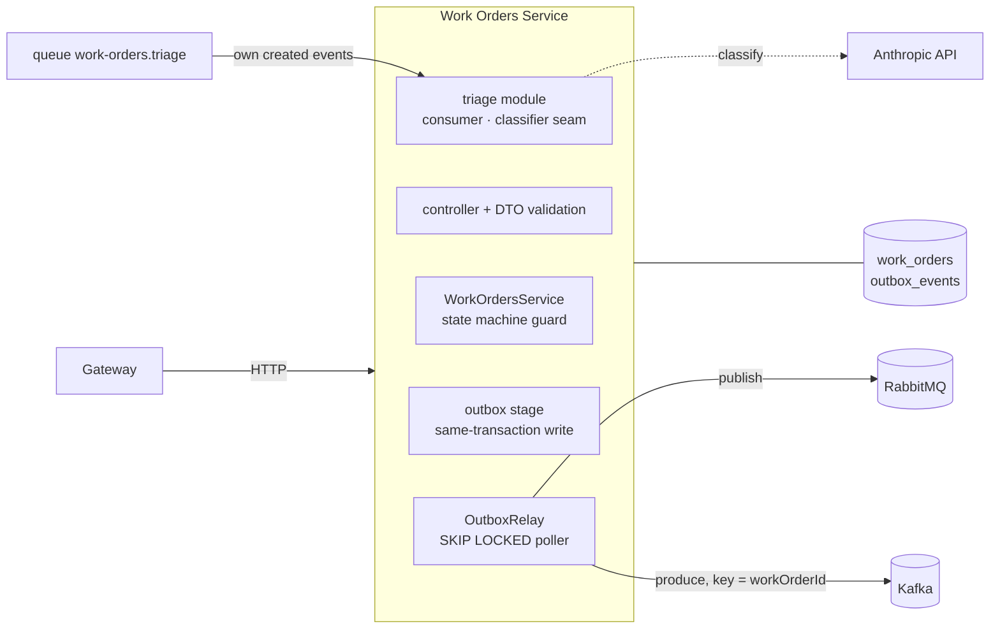
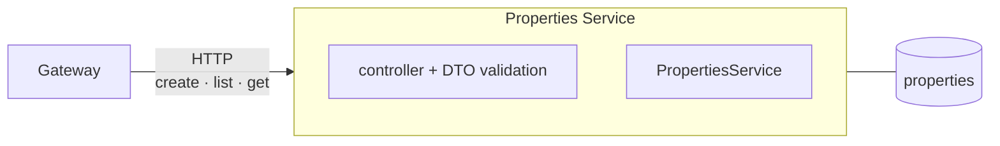
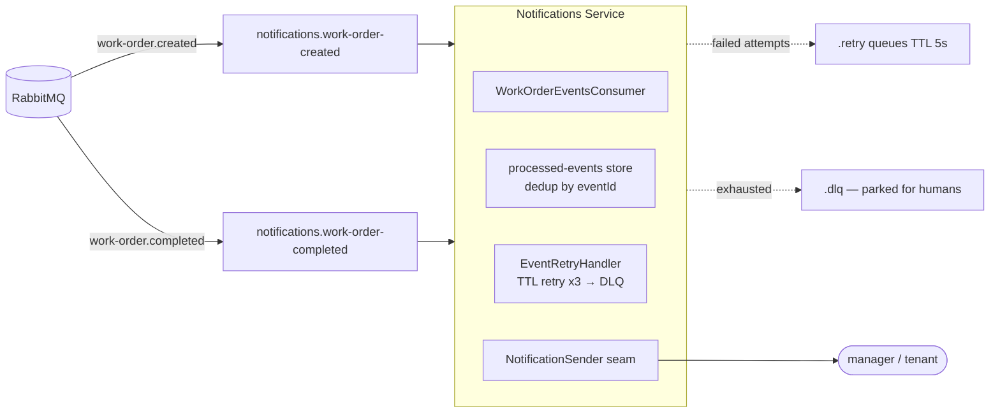
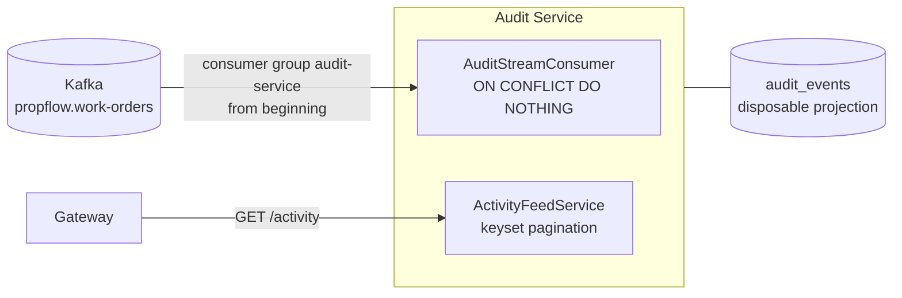

# Services map

What each service **is for** — its mission, the world it sees, and (just as important) its explicit non-responsibilities. This sits between the [architecture overview](index.md#architecture) and the [sequence flows](flows.md): the overview shows the boxes, the flows show them moving, this page explains why each box exists.

Every service follows the same physique: owns its data outright (database-per-service), speaks HTTP only through the gateway, and reacts to the world through events.

---

## API Gateway — the single front door (:3000)

**Mission:** be the only thing the internet can reach — authenticate once, authorize per route, proxy to the owning service, and compose cross-service reads without ever owning data.

**Owns:** nothing durable — the gateway is stateless by design; restarting it loses nothing.

**Responsibilities:** JWT verification and role policy ([ADR-0008](adr/0008-authentication.md)) · identity/correlation propagation · timeout + fail-fast on every downstream call · graceful degradation in composition ([flow 6](flows.md#6-property-summary-composition-with-graceful-degradation)) · publishing the API reference.

**Explicitly NOT its job:** payload validation (lives with the service that owns the data — a rule change must not be a two-deploy event) · business rules · talking to brokers or databases.

---

## Work Orders — the core aggregate (:3001)

**Mission:** own the maintenance request from birth to terminal state — the state machine, the AI triage, and the *only* place domain events are born.

**Owns:** the `work_orders` table, the `outbox_events` staging table, the lifecycle rules ([flow 8](flows.md#8-work-order-lifecycle-state-machine)) and the triage vocabulary.

**Responsibilities:** every state transition, guarded · staging state + event atomically ([ADR-0007](adr/0007-outbox-pattern.md)) · relaying to both brokers · reacting to its *own* `created` event with best-effort LLM classification ([ADR-0006](adr/0006-llm-triage.md)).

**Explicitly NOT its job:** knowing who gets notified · serving the activity feed · property data (it stores `propertyId` as an opaque reference — never a foreign key into another service's database).

---

## Properties — the quiet registry (:3003)

**Mission:** be the source of truth for buildings and their managers — the stable entity the volatile work orders point at.

**Owns:** the `properties` table.

**Responsibilities:** CRUD with validation, nothing more — and that is the point: a service is allowed to be small when its domain is small.

**Explicitly NOT its job:** knowing that work orders exist. The reference goes one way (work order → propertyId); the gateway composes the two when a view needs both ([flow 6](flows.md#6-property-summary-composition-with-graceful-degradation)). It emits no events yet — a second event producer would need its own outbox.

---

## Notifications — the pure reactor (:3002)

**Mission:** turn domain events into messages humans receive — and absorb every delivery failure so the rest of the system never waits for an email.

**Owns:** nothing durable — no database, no HTTP API beyond health/metrics. Its only state is the in-memory dedup store (the documented reason it runs as a single replica).

**Responsibilities:** consuming with at-least-once discipline (dedup, mark-after-send) · the retry/DLQ machinery ([flow 5](flows.md#5-notification-delivery-retries-and-the-dead-letter)) · keeping the sender behind a seam so channels (email/SMS/push) are an implementation detail.

**Explicitly NOT its job:** being a source of truth for anything. If it vanished, no data would be lost — only messages delayed. That property is what "pure reactor" means.

---

## Audit — the memory (:3004)

**Mission:** answer "what happened, when, and who did it" — by projecting the replayable Kafka log into a queryable feed, forever.

**Owns:** the `audit_events` projection — deliberately *disposable*: the source of truth is the log, and a fresh consumer group at offset 0 rebuilds the table from history ([ADR-0002](adr/0002-rabbitmq-first-kafka-later.md)).

**Responsibilities:** idempotent ingestion of every domain event (including the AI's triage decisions, with `actorId` answering *who*) · serving the feed with cursor pagination stable under constant appends ([flow 7](flows.md#7-activity-feed-audit-read-path-and-how-it-fills)).

**Explicitly NOT its job:** writing domain state — it never produces an event, never calls another service, and its table can be truncated without losing anything the log still holds.

---

## Reading the boundaries as a system

Three patterns repeat across every section above, and they *are* the architecture:

1. **Ownership is absolute** — each arrow into a database comes from exactly one service; every cross-service reference is an opaque id.
2. **Sync for questions, async for consequences** — the gateway's arrows carry queries; everything that *happens because* of a change travels as an event.
3. **A service's value shows in what it refuses to do** — the gateway refuses validation, properties refuses to know work orders, notifications refuses to own truth, audit refuses to write state. The refusals keep the seams clean.
